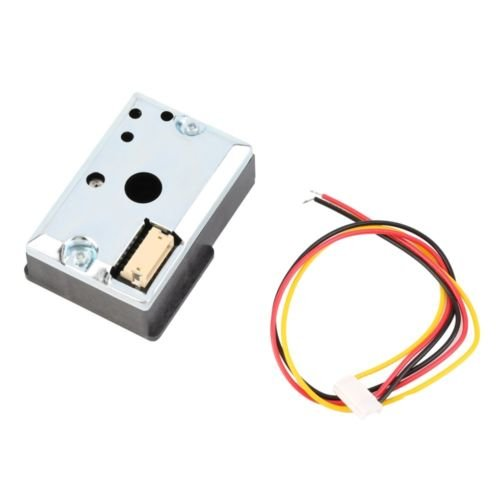

# Dust_Sensor_GP2Y1051AU0F

Serial port output parameters:
1) Baud rate: 2400 bit / s:
2) One byte is sent for every 10 ms, with a total of 7 bytes, in which the check = vOut (h) + vOut (l) + VREF (H) + VREF (L):
3) Data transmission format:

4) Data processing:
The received data is calculated according to the formula, and the output value is obtained: vOut = (vOut (h) * 256 + vOut (l) / 1024 * 5.

## For example:
Output (h) = 0x01, converted to Decimal In 1:
VOut (l) = 0x3a, converted to Decimal En 58;
VOut = (58) 1 * 256 + / 1024 * 5 = 1. 533 v.
